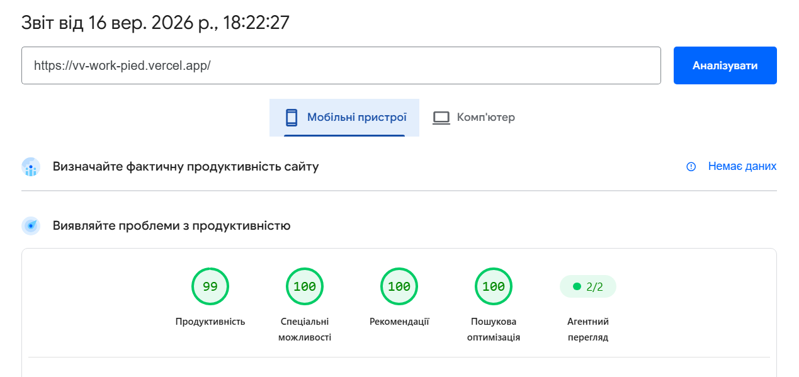
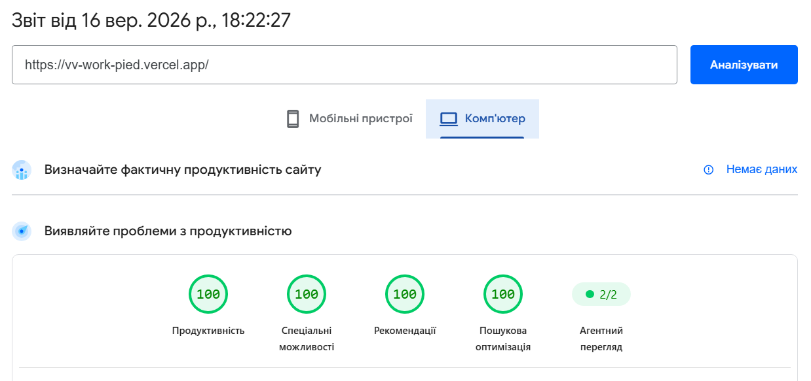

# VV Work

VV Work — MVP платформи для пошуку роботи та працівників у Європі. Проєкт реалізований як frontend-застосунок на React: головна сторінка, сторінка партнера/роботодавця, контакти, сторінки про компанію, для роботодавців, список партнерів, юридичні сторінки та детальна сторінка вакансії.

## Демо

- Production: https://vv-work-pied.vercel.app
- GitHub: https://github.com/KirillVGX/vv-work

## Стек

- Vite
- React
- TypeScript
- Tailwind CSS
- React Router
- Vitest
- Testing Library
- axe-core
- Oxlint
- GitHub Actions
- Vercel

## Запуск локально

```bash
npm install
npm run dev
```

Після старту застосунок буде доступний за адресою, яку покаже Vite, зазвичай:

```bash
http://localhost:5173
```

## Скрипти

```bash
npm run dev
npm run build
npm run preview
npm run test
npm run lint
```

- `dev` — локальний dev-сервер.
- `build` — TypeScript-перевірка та production-збірка.
- `preview` — локальний перегляд production-збірки.
- `test` — unit та accessibility-тести.
- `lint` — статична перевірка коду через Oxlint.

## Основні сторінки

- `/` — головна сторінка з hero, пошуком, категоріями, статистикою, партнерами, новинами, інформаційними блоками та CTA.
- `/partners` — сторінка всіх партнерів.
- `/partners/:slug` — сторінка партнера з описом, інформацією та вакансіями.
- `/vacancies` — сторінка пошуку вакансій.
- `/vacancies/:id` — детальна сторінка вакансії.
- `/employers` — сторінка для роботодавців.
- `/about-us` — сторінка про компанію.
- `/contacts` — сторінка контактів із формою заявки.
- `/privacy-policy` — політика конфіденційності.
- `/terms` — умови використання.

## Функціональність

- Пошук вакансій з debounce без сторонніх бібліотек.
- Фільтрація вакансій за категорією, країною та пошуковим запитом.
- Мокова fetch-обгортка з випадковою затримкою, помилками та retry-станами.
- Skeleton/loading/error states для асинхронних блоків.
- Форма заявки з клієнтською валідацією та оптимістичним UI.
- Збереження вакансій у `localStorage`.
- Пагінація вакансій партнера через перевикористовуваний компонент.
- Адаптивна верстка для desktop, tablet та mobile.
- Доступні стани фокусу, aria-label для інтерактивних елементів, axe-перевірки.
- CI для тестів, lint та build.

## Архітектура

```text
src/
  api/                 # мокові API, fetch-обгортка, типи відповідей
  components/
    home/              # компоненти головної та вакансій
    layout/            # Header, Footer, AppLayout
    partner/           # компоненти сторінки партнера
    ui/                # базові UI-примітиви
  data/                # демо-дані вакансій, партнерів, категорій
  hooks/               # спільні React-хуки
  pages/               # сторінки роутингу
  types/               # доменні типи
```

Компоненти розділені за відповідальністю: сторінки збирають сценарій, доменні компоненти відповідають за конкретні блоки, `api/` ізолює асинхронність, а `ui/` містить перевикористовувані примітиви.

## Асинхронність і стани

Дані вакансій, партнерів, свят і зарплат завантажуються через мокову API-обгортку. Вона імітує реальний бекенд:

- випадкова затримка відповіді;
- випадкова помилка запиту;
- єдині типи `ApiSuccess` / `ApiFailure`;
- retry-логіка на сторінках і блоках з асинхронними даними.

Це дозволяє перевірити не лише успішний сценарій, а й поведінку інтерфейсу під час loading/error states.

## Тестування

У проєкті є тести для ключової логіки:

- debounce-пошук;
- retry-логіка API-хука;
- фільтрація та пагінація вакансій;
- accessibility-перевірки через `axe-core`.

Запуск:

```bash
npm run test
```

Поточна перевірка:

```text
Test Files: 5 passed
Tests: 16 passed
```

## Lighthouse

Production-збірка перевіряється у PageSpeed Insights / Lighthouse. Нижче залишені місця для фінальних скриншотів.

### Mobile



```text
Performance: 99
Accessibility: 100
Best Practices: 100
SEO: 100
```

### Desktop



```text
Performance: 100
Accessibility: 100
Best Practices: 100
SEO: 100
```

## CI/CD

GitHub Actions запускаються для pull request та push у `main` / `master`.

CI перевіряє:

- встановлення залежностей;
- тести;
- lint;
- production build.

Деплой налаштований через Vercel CLI. Для автоматичного деплою потрібні GitHub Secrets:

- `VERCEL_TOKEN`
- `VERCEL_ORG_ID`
- `VERCEL_PROJECT_ID`

Якщо секрети Vercel не задані, workflow пропускає тільки deploy-кроки після успішних перевірок.

## Мої рішення

1. Головна побудована як швидкий сценарій входу: користувач одразу бачить цінність сервісу, пошук, категорії та соціальний доказ через статистику/партнерів.
2. Пошук і фільтри винесені в окрему логіку, щоб одночасна робота кількох фільтрів була передбачуваною і не створювала зайвих обчислень у списках вакансій.
3. Для асинхронних даних використана власна мокова API-обгортка з loading/error/retry, бо це ближче до реального продуктового сценарію, ніж статичний масив у компоненті.
4. Замість Redux/Zustand використані локальний стан, хелпери та невеликі хуки: для поточного масштабу MVP цього достатньо і код легше продовжувати.
5. Я розширив бриф додатковими сторінками та деталями вакансій, щоб навігація виглядала як цілісний продукт, а не набір окремих демо-блоків.

## Відхилення від брифу

- Додані сторінки `/about-us`, `/employers`, `/partners`, `/vacancies/:id`, `/privacy-policy` і `/terms`, бо ці посилання присутні в навігації та футері.
- Додано збереження вакансій і детальну сторінку вакансії як корисне розширення MVP-сценарію для кандидатів.

## Дизайн

Базова палітра:

- Background: `#F7F8F5`
- Surface: `#FFFFFF`
- Primary / Navy: `#17212B`
- Accent / Lime: `#B8F34A`
- Accent hover: `#A5DE38`
- Text: `#17212B`
- Secondary text: `#68727D`
- Border: `#E4E7E3`
- Success: `#22A06B`
- Error: `#D64545`
